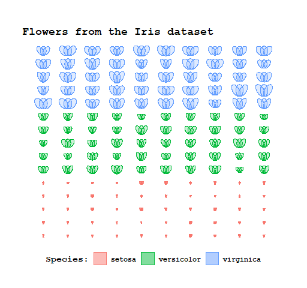

# Iris Visualisation
Trying to draw the flowers from the Iris dataset using `ggplot2`.

The outcome looks like this:

The flowers are placed in a grid according to their position in the dataset. It just happened that the dataset was already organised by species, so the grid is also grouped by `Species`. Three petals are then drawn as ellipses with their widths and heights defined by the variables `Petal.Width` and `Petal.Length`, respectively.
